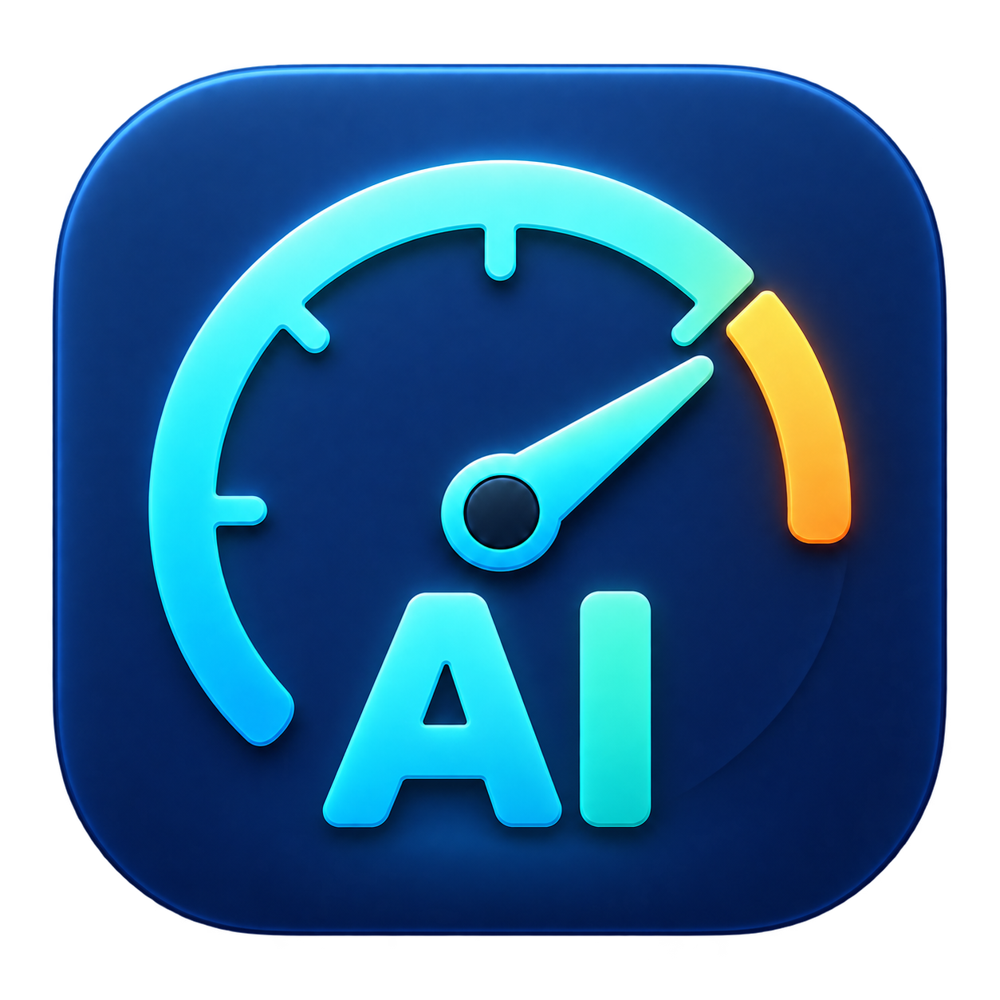

<p align="center">
  
</p>

<h1 align="center">RateLimitBar</h1>

<p align="center"><a href="README.md">English</a> | 日本語</p>

<p align="center">Claude・Codex・Cursor の使用率を、macOS のメニューバーで。</p>

<p align="center">
  <a href="https://github.com/ara-ta3/RateLimitBar/actions/workflows/ci.yml"></a>
  
  
</p>

RateLimitBar は、AI コーディングツールの使用率とリセットまでの残り時間を表示するメニューバーアプリです。60 秒ごとに自動更新し、表示するサービスや利用枠を選べます。

```text
Claude 5h 23% (2h30m) / W 48% (3d4h)  Codex 5h 61% (1h20m)  Cursor M 18% (12d3h)
```

*表示例。`W` は週間、`M` は月間の利用枠を表します。数値は使用済みの割合です。*

## 特徴

- **3 サービスをまとめて確認** — Claude・Codex・Cursor の使用率を表示。
- **リセットまでの時間を表示** — 取得できたリセット時刻から残り時間を表示。
- **表示項目を選択** — サービスの利用枠ごとにオン・オフを切り替え。
- **自動・手動更新** — 60 秒ごとの更新に加え、メニューの `Refresh` で再取得。
- **メニューバーに常駐** — Dock に表示せず、Finder から起動可能。

## 対応サービス

| サービス | 表示する利用枠 | 取得元・必要な環境 |
| --- | --- | --- |
| Claude | 5 時間・週間 | `~/.claude.json` の `cachedUsageUtilization`。Claude Code の使用率キャッシュが必要 |
| Codex | 5 時間・週間・取得できたモデル固有の枠 | `codex app-server`。インストール・ログイン済みの `codex` CLI が必要 |
| Cursor | 月間 | macOS Keychain のアクセストークンと usage API。Cursor の認証情報が Keychain に保存されている必要あり |

Claude は通常、ローカルのキャッシュを読み取ります。15 分より古いキャッシュには、ドロップダウンで `(stale)` を付けます。必要に応じて[キャッシュの自動更新](#claude-のキャッシュ自動更新)を有効にできます。

## セットアップ

### 必要な環境

- macOS
- Go 1.27 以降
- Xcode Command Line Tools（`xcode-select --install` でインストール）
- 利用するサービスの認証済み CLI またはローカル認証情報（上の表を参照）

### ソースからビルドして起動

```sh
git clone https://github.com/ara-ta3/RateLimitBar.git
cd RateLimitBar
make app
open dist/RateLimitBar.app
```

`dist/RateLimitBar.app` は、ビルドした Mac の CPU 向けに生成されます。Finder でダブルクリックして起動でき、`/Applications` にコピーして使うこともできます。

> 生成されるアプリはローカル利用向けです。Developer ID 署名・公証は行いません。

## 使い方

メニューバーの表示をクリックすると、使用率の詳細や設定を確認できます。

| メニュー項目 | 操作 |
| --- | --- |
| 各サービスのチェック付き項目 | 利用枠ごとにメニューバーへの表示を切り替え |
| `Refresh` | 使用率を再取得 |
| 取得元の設定 | Codex・Claude の CLI パスを確認・変更 |
| Claudeのキャッシュを自動更新 | 古いキャッシュを Claude CLI で更新 |
| `Quit` | アプリを終了 |

表示項目は起動時にすべてオンになります。表示の選択と Claude のキャッシュ自動更新のオン・オフは、次回起動時に引き継ぎません。

残り時間は使用率の取得時に更新します。1 分未満は `<1m`、リセット時刻を過ぎると `0m` を表示し、リセット時刻が取得できない枠は使用率だけを表示します。取得前やすべての表示項目がオフのときは、メニューバーに `RateLimit` と表示します。

### CLI の取得元を設定

初期状態では、アプリの `PATH` から `codex` / `claude` を自動検出します。macOS アプリから起動するときは `$SHELL`（未設定なら `/bin/zsh`）のログイン環境を読み込みます。

CLI が見つからない場合や、特定の実行ファイルを使いたい場合は、次の手順で指定できます。

1. メニューの「取得元の設定」を開く。
2. 「未検出（指定…）」または表示された CLI パスをクリックする。
3. 実行ファイルを選択する。ファイル選択画面で `⌘⇧G` を押すと、パスを入力できます。

CLI のパスはターミナルで確認できます。

```sh
command -v codex
command -v claude
```

指定したパスは `~/Library/Application Support/RateLimitBar/settings.json` に保存され、次回起動時にも使われます。指定後は自動で再取得します。

指定した実行ファイルが削除された場合は「未検出」と表示します。再指定するか、「取得元の指定をすべて解除（自動検出に戻す）」で `PATH` 検索に戻せます。

Claude CLI はキャッシュの自動更新に使用します。通常のキャッシュ表示には必要ありません。Cursor は Keychain と API を使用するため、この設定の対象外です。

### Claude のキャッシュ自動更新

メニューの「Claudeのキャッシュを自動更新」をオンにすると、キャッシュが 15 分より古い場合に次のコマンドを実行し、完了後にキャッシュを読み直します。

```sh
claude -p '/usage'
```

- 起動時はオフ。アプリを起動したまま切り替えられます。
- インストール・ログイン済みの `claude` CLI が必要で、更新時に通信が発生します。
- コマンドはプロジェクト外の一時ディレクトリで実行し、30 秒でタイムアウトします。
- 失敗時は取得エラーを表示し、次の更新時に再試行します。
- キャッシュがない場合や読み取れない場合は、自動更新の対象にしません。

## トラブルシューティング

| 症状 | 確認すること |
| --- | --- |
| CLI が見つからない | 「取得元の設定」で実行ファイルを指定してください。`~/.zshrc` だけに設定した `PATH` は、Finder 起動時には読み込まれません |
| Claude に `(stale)` が付く | キャッシュが 15 分より古い状態です。Claude Code で更新するか、キャッシュの自動更新を有効にしてください |
| `Failed to fetch` が表示される | 対応サービスの認証状態と取得元を確認し、`Refresh` で再取得してください。Cursor は Keychain の認証情報と API への接続が必要です |

## 開発

```sh
make build      # bin/ratelimitbar を生成
make run        # ビルドしてターミナルから起動
make app        # dist/RateLimitBar.app を生成
make test       # テストを実行
make fmt/check  # Go の整形を適用し、差分がないことを確認
```

ターミナルから起動した場合は、`Ctrl+C` でも終了できます。CI は macOS 上で整形チェック・ビルド・テストを実行します。

### ディレクトリ構成

```text
cmd/app/           エントリーポイント・設定操作
internal/config/   CLI パス設定の保存
internal/dialog/   ファイル選択ダイアログ
internal/menubar/  メニューバーの表示・操作・更新
internal/provider/ 各サービスの使用率取得
internal/usage/    使用率データの型
packaging/macos/   macOS アプリのアイコン・起動スクリプト・Info.plist
```

## フィードバック・コントリビューション

不具合報告や機能提案は [Issues](https://github.com/ara-ta3/RateLimitBar/issues) へ、変更案は Pull Request で受け付けています。不具合報告には、macOS のバージョン、対象サービス、再現手順を添えてください。認証トークンなどの機密情報は含めないでください。
